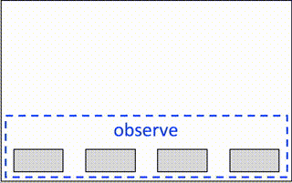
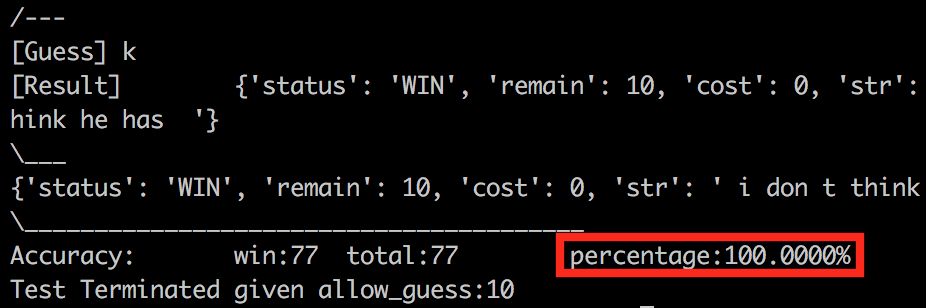
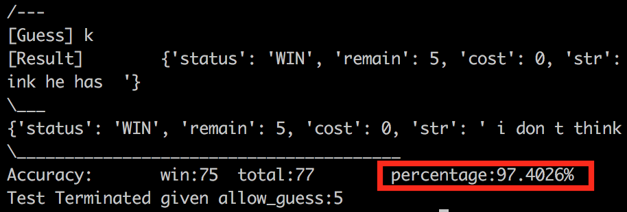
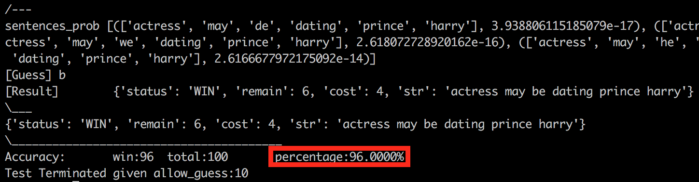
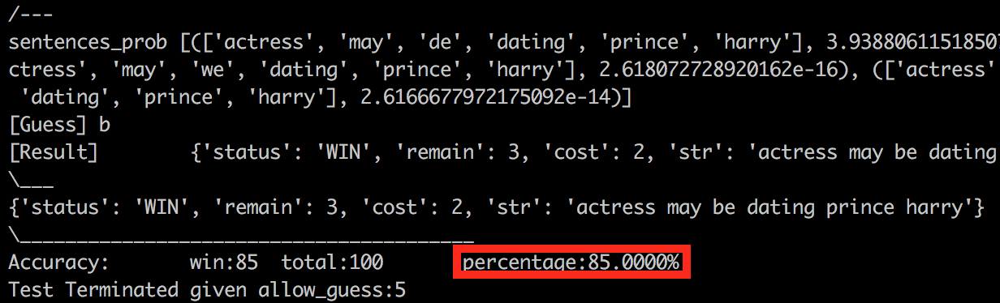

# Project Hangman Game AI
## implemented using Hidden Markov Model



Compilers:
- Python 2.7

Run Instructions:

1. modify following parameters

  ```python
  allow_guess = 5     #[hard code!]
  test_game('test_long.txt', allow_guess)     #[hard code!]
  ```
  ```python
  max_num_words = 5   #[hard code!]
  max_num_sentences = 5 #[hard code!]    
  naive_guess_max_perventage = 0.4  #[hard code!]
  ```
  
2. run

  ```sh
  $ python Play.py
  ```


\*Further: implement viterbi algorithm to reduce the run complexity of get_sentences_prob() from dfs's m^n to m\*n, but may expect some accuracy loss

Test Results:

1. test long sentences given allow guess as 10 (guess why achieve 100% here)


2. test long sentences given allow guess as 5


3. test short sentences given allow guess as 10


3. test short sentences given allow guess as 5

